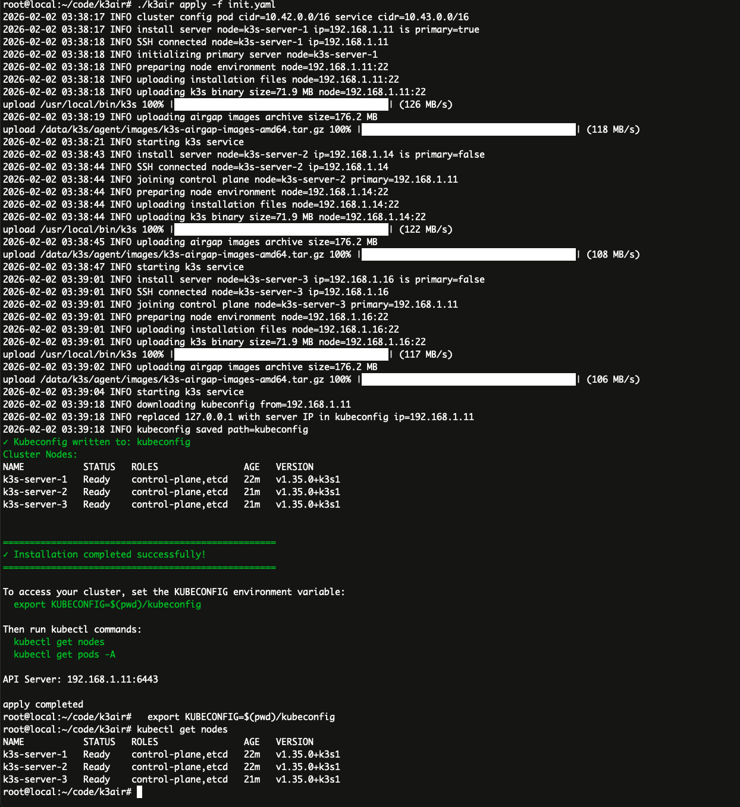

# k3air

k3air 是一个使用 Go 编写在离线环境下安装高可用 k3s 集群的命令行工具，它不依赖任何外部服务网络，所有的组件都在本地运行。k3air 支持一个 yaml 格式的配置文件，用户可以在配置文件中定义 k3s 集群的节点（节点数量没有限制，可以是一个，也可以是多个），网络，启动参数等信息，所有依赖都打包成离线文件，然后通过 k3air 命令来 k3s 集群。

1. 生成默认配置
```bash
k3air init
```
2. 编辑配置文件
3. 开始部署
```bash
k3air apply -f init.yaml
```

配置文件示例：
```yaml
cluster:
    #flannel-backend: vxlan
    flannel-backend: host-gw
    cluster-cidr: 10.42.0.0/16
    service-cidr: 10.43.0.0/16
    token: k3air-token
    tls-san: []
    disable:
      - traefik
      - metrics-server
      - local-storage
      #- servicelb
    data-dir: /data/k3s
    embedded-registry: true
    registries: |
      mirrors:
        "docker.io":
          endpoint:
            - "https://192.168.1.11:6443"
        "harbor.mastergo.com":
          endpoint:
            - "https://192.168.1.11:6443"
      configs:
        "192.168.1.11:6443":
          tls:
            insecure_skip_verify: true

# Assets configuration
# Supports local file paths or HTTP/HTTPS URLs
# If empty, defaults to: k3s (current directory) and k3s-airgap-images-amd64.tar.gz
# URLs will be downloaded to a temp directory and auto-deleted after installation
assets:
  # Required: k3s binary (local path or URL)
  # Default: ./k3s
  #k3s-binary: "http://192.168.1.8:8100/k3s"
  # k3s-binary: "https://github.com/k3s-io/k3s/releases/download/v1.28.5+k3s1/k3s"

  # Optional: airgap images tarball (local path or URL)
  # Default: ./k3s-airgap-images-amd64.tar.gz
  #k3s-airgap-tarball: "http://192.168.1.8:8100/k3s-airgap-images-amd64.tar.gz"
  # k3s-airgap-tarball: "https://github.com/k3s-io/k3s/releases/download/v1.28.5+k3s1/k3s-airgap-images-amd64.tar.gz"

servers:
    - node_name: k3s-server-1
      ip: 192.168.1.11
      port: 22
      user: root
      password: "password"
    - node_name: k3s-server-2
      ip: 192.168.1.14
      port: 22
      user: root
      password: "password"
    - node_name: k3s-server-3
      ip: 192.168.1.16
      port: 22
      user: root
      password: "password"
agents: []
```
